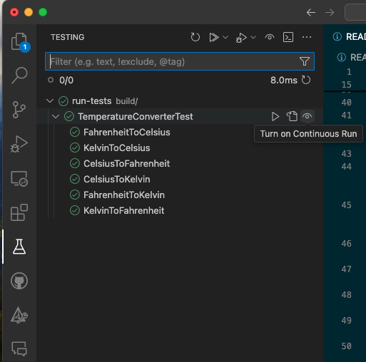
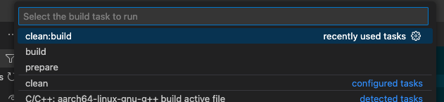

# GitHub Copilot C++ Workshop

 [:jp: Japanese](README.md) | [:us: English](README.en.md)

こちらは、[GitHub Copilot](https://github.com/features/copilot) の使用方法を紹介するハンズオンワークショップです。異なる単位の間で変換を行うCLIツールを提供します。

## 事前準備
下記ツールが必要となります。

- [ ] `cmake` がインストールされていること
- [ ] `make` がインストールされていること
- [ ] `gcc` がインストールされていること
- [ ] `vscode` がインストールされていること

また、DevContainerを利用する場合は、下記の拡張機能がインストールされていれば、`cmake`や`make`などのツールは不要です。

- [ ] `ms-vscode-remote.remote-containers`

## Getting Started

以下コマンドが実行出来るか確認してください。DevContainerを利用する場合は、DevContainerを開いてから実行してください。

### Build

```bash
cmake -S . -B build
cmake --build build
```

### Run & Test

- 実行するには、以下のコマンドを実行してください。摂氏と華氏の変換ができるCLIツールが起動します。

    ```bash
      ./build/main
    ```

- テストをするには、以下のコマンドを実行してください。

    ```bash
      ./build/run-tests
    ```

### Run as VSCode Tasks

これらのコマンドは `.vscode/tasks.json` で定義されています。 VSCode Task Runner で実行することも可能です。実行するには次のキーを入力してください。 <key>cmd</key>+<key>shift</key>+<key>p</key>:

| Task                | Description                                                                                                       |
| ------------------- | ----------------------------------------------------------------------------------------------------------------- |
| `prepare`           | Runs `cmake -S . -B build` command. You most likely won't have to run this command manually, use `build` instead. |
| `build`             | Runs `Prepare` followed by `cmake --build build` command                                                          |
| `clean:build`       | Same as `Build`, but Removes the directory before executing the Build step                                        |
| `Start Application` | Runs the `./build/main` command                                                                                   |
| `Run Tests`         | Runs the `./build/run-tests` command                                                                              |

## より高度な実行方法(オプション)

buildするごとにテストを自動実行することも可能です。

- [ ] `C++ TestMate` 拡張機能がインストールされていること
- [ ] 拡張機能を左のメニューから選択、自動で実行したいテスト項目を画像のとおり目のマークの部分をクリック

- [ ] <key>cmd or ctl</key>+<key>shift</key>+<key>b</key> で `build` または `clean&build` を行うたびにテストが実行されることを確認


## ハンズオン

- [ ] `Distance`変換クラスを完成させ、`main.cpp`に含める（オプションとして、最初にテストを実装し、TDDアプローチを取る）
- [ ] `Distance::convertDistance`のテストを追加する
- [ ] すべての`printf`と`scanf`をリファクタリングし、`std::cout`と`std::cin`を使用する
- [ ] キロとポンドの間で変換するための新しい`Weight`変換クラスを追加する
- [ ] コードの問題点を発見し、Copilotの助けを借りて問題を解決する
- [ ] あなたのアイデアで新しい機能を追加し、Copilotの助けを借りて実装する
